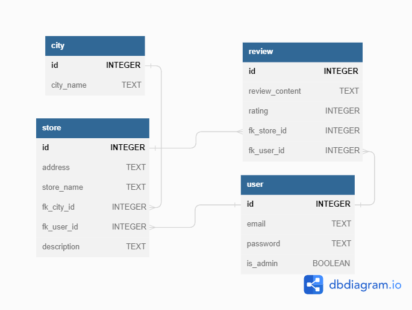

# Grocery Store REST API SQL Database Group Assignment

## Description

The assignment was to create a rest API with a SQLite database. The goal was to create a review site for grocery stores, where you can see the stores, register, login and review the stores. The user should also be able to delete and update certain data.

Node
Express server

### Preparations

Our dbDiagram

### Users

Email: testus@gmail.com, password: "testar123" (admin)
Email: ksenia.ivanova@gmail.com, password: "password456" (user & owner)
Email: petra.elgemyr@gmail.com, password: "password789" (user & owner)
Email: hazan@gmail.com, password: "password123" (user & owner)
Email: user1@gmail.com, password: "userPassword123" (user)
Email: user2@gmail.com, password: "userPassword456" (user)
Email: user3@gmail.com, password: "userPassword789" (user)
